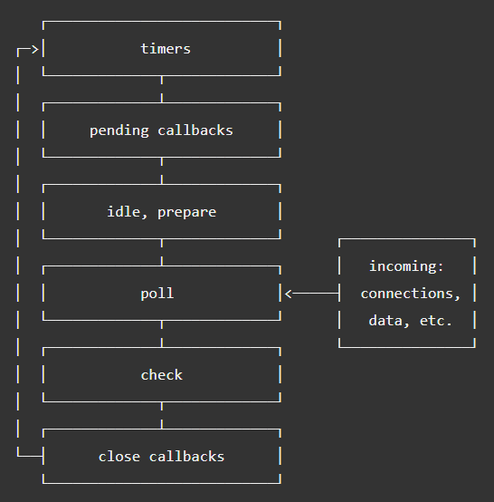
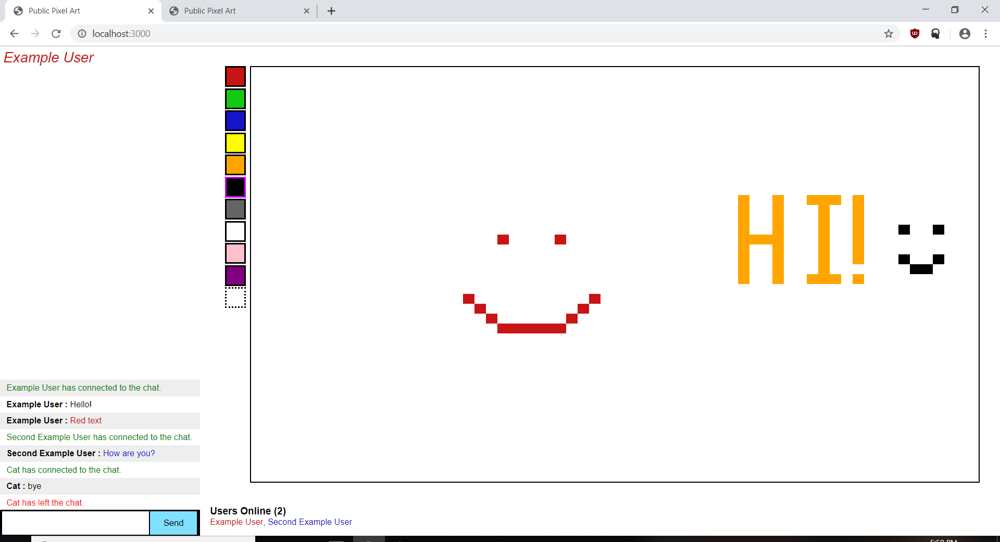

Node.js
=======

.. figure:: img/node.svg

Introduction
------------

Most websites and web applications must implement some form of a client-server
network for them to have any meaningful functionality. There are many languages
and technologies that allow you to implement this. However, if you wanted to
create this application using JavaScript then you run into an issue. JavaScript 
only handles client-side programming. If you wanted to create a client-server 
network using JavaScript, you would have to write the server-side code in Java,
or some other language. Node.js solves this issue by bringing JavaScript to the 
server-side. Node.js has an interesting history, and comes with a plethora of 
features and design choices that make it a scalable and efficient runtime 
environment for web development.

History
-------

The most similar predecessor to Node.js was called, "NetScape LiveWire". 
Unfortunately, there wasn't a large demand for server-side JavaScript at the 
time. As a result, NetScape LiveWire was ultimately unsuccessful. As JavaScript 
became more advanced and efficient, the demand for server-side JavaScript 
capabilities also increased. This lead to the introduction of Node.js in 2009, 
created by Ryan Dahl [NodejsDev]_.

Node.js allows developers to create server-side JavaScript through the Node.js 
runtime environment. Shortly after its creation, other important libraries and 
features were created. Npm was created in 2009, and both Express and Socket.io 
were created in 2010. Node.js would continue to be updated with a new stable 
version every year, with Node.js 8 being released in 2017 and Node.js 10 being 
released in 2018 [NodejsDev]_. The odd numbered Node.js versions are considered 
to be betas and the even numbered versions are considered as stable builds 
[LearningNode]_.

An Introduction to Node.js
--------------------------

What is it?
^^^^^^^^^^^

Node.js is a runtime environment that brings JavaScript to the server-side. It
allows you to create web applications using nothing but JavaScript. Many
developers are experienced with JavaScript and client-side programming.
However, they may not be experienced with languages that support server-side
programming like Java. This allows these developers to move to server-side 
programming without changing languages [Nodejs]_. 

Node.js has other advantages as well. For example, Node.js is single-threaded. 
Multi-threaded networking tends to be less efficient and is difficult to 
implement. Since Node.js is single-threaded, it's far less likely to have 
thread-related bugs or issues. Despite being single-threaded, Node.js will never 
lock because everything is asynchronous. This also allows Node.js to handle 
thousands of requests at the same time [Nodejs]_. 

Node.js runs on the Chrome V8 JavaScript engine. This makes it run very quickly,
even for large-scale applications. Node.js has a massive collection of libraries 
that can be easily installed through npm. Some popular examples of these 
libraries are express, socket.io, koa, Colors, and more. It allows you to easily 
create and implement your own modules as well [Nodejs]_.

How does it work?
^^^^^^^^^^^^^^^^^

Unlike traditional programming, Node.js doesn't run line by line. Instead, 
Node.js relies on something called, "Asynchronous Programming". This isn't a new 
concept introduced by Node.js. However, Node.js uses it nearly exclusively 
[LearningNode]_. The following jQuery code is an example of Asynchronous 
Programming.

.. code-block:: javascript
	:caption: jQuery on click

	$('#example').on("click")

This program doesn't stall while waiting for that function to call. Rather, it 
calls that function when the event actually happens. That is how Node.js works.
It is entirely event-based and relies on functions like the example above.
Asynchronous Programming is advantageous because as mentioned earlier, it will
never stall. It allows the website the process multiple things concurrently 
and supports live updates. To understand how Node.js implements Asynchronous 
Programming, consider the following, "Hello World!" example [LearningNode]_.

.. code-block:: javascript
	:caption: Hello World

	var http = require('http');

	http.createServer(function(req, res) {
		res.writeHead(200, {'content-type': 'text/plain'});
		res.end("Hello world!\n");
	}).listen(8124);

So what does each line of this program actually do?

* ``var http = require('http');`` 
	This loads the HTTP module which is essential for basic HTTP functionality 
	and network access.

* ``http.createServer(function(req, res)`` 
	This is a function within the HTTP module that creates a basic server. An 
	anonymous function is passed in the parameter with the arguments of *req* 
	and *res* which represent a server request and a server response. This 
	function doesn't need to be anonymous.

* ``res.writeHead(200, {'content-type': 'text/plain'});`` 
	This modifies the content type and status code of the response.

* ``res.end("Hello world!\n");`` 
	This line writes, "Hello world!" and ends the response. Alternatively, you 
	could do the following for the same effect. 

	``res.write("Hello world!\n");``

	``res.end();``

* ``.listen(8124);``
	This last line is an example of asynchronous programming. It's asynchronous 
	because it only calls when the connection to the port is established.

[LearningNode]_

The Event Loop
^^^^^^^^^^^^^^

So how do these asynchronous functions actually work? Node.js relies on 
callbacks and operates with something called, "The Event Loop". The Event Loop 
operates in a series of phases. These phases can best be described with the 
following graph [EventLoop]_.

	
	[EventLoop]_

So, the data starts by going to the *poll* phase which simply receives input
or data. Next, it goes to the *check* phase which is where ``setImmediate()``
callbacks are executed. Then any callbacks involving disconnections or closings 
are called in the *close callbacks* phase. Then it runs all the callbacks 
defined by the timers in the *timers* phase. For example, through 
``setTimeout()`` or ``setInterval()``. Lastly, it runs any other callbacks that 
are still pending in the *pending callbacks* phase. There's also the 
*idle, prepare* phase but these can't be influenced since they run internally 
[EventLoop]_.

Timers can be used to delay the execution of some function. The most common way
to accomplish this is through ``setTimeout()`` or ``setInterval()``. The 
difference between these two is that ``setTimeout()`` runs once after the 
designated time, and ``setInterval()`` will continue running indefinitely with 
the interval as the designated time. For example, the following code will print 
out, "Hello World!" to the Node.js server console 1000 milliseconds after the 
program starts [LearningNode]_.

.. code-block:: javascript
	:caption: Hello World

	function hello(res) {
		console.log("Hello World!");
	}

	setTimeout(hello, 1000);

The following uses ``setInterval()`` instead, in this example it prints out, 
"Hello World!" every 1000 milliseconds indefinitely.

.. code-block:: javascript
	:caption: Hello World

	function hello(res) {
		console.log("Hello World!");
	}

	setInterval(hello, 1000);

[LearningNode]_

What are its disadvantages?
^^^^^^^^^^^^^^^^^^^^^^^^^^^

Node.js has many advantages. However, it also has some issues. One major issue
is that Node.js is not designed for computationally expensive applications. For
example, it would not work well for optimization problems, or a GPS navigation 
application that calculates the best path to a destination. It's better to use
Node.js for lightweight applications that have a lot of clients at once, such as
chat rooms [LearningNode]_.

Since Node.js is asynchronous, it comes with an additional problem sometimes 
referred to as, "The Pyramid of Doom". This happens when there's an excess of 
nested callbacks that leads to an unreadable mess. However, 
"The Pyramid of Doom" can be easily fixed by having callbacks call outside 
functions rather than putting the code inside the actual callback. An even 
better solution is to use the Waterfall feature of the Async module. This 
feature works by chaining these callbacks together in an array [LearningNode]_.

Modules of Node.js
------------------

There are a plethora of modules you can install with npm. Each of them have
their own unique features and uses. Developing Node.js applications is much 
easier through the use of modules. For example, some of the most important
ones are socket.io and express. These modules greatly simplify the process of
writing Node.js applications.

Socket.io
^^^^^^^^^

Socket.io makes communication between the server and its clients easier.
Socket.io can also be used with Express which will be mentioned in a later 
section. How Socket.io works can be seen with the following code. This comes 
from the example project found at the end [SocketIo]_.

.. code-block:: javascript
	:caption: socket.io implementation

	// This runs when a user connects to the server.
	io.on('connection', function(socket) {
		// Some omitted stuff...

		// Tell the client (and only this client, that's why it's io.to) that they connected to the server.
		io.to(socket.id).emit('on page loaded', picture);

		// More omitted stuff...

		// Runs when a user leaves the chat.
	  	socket.on('disconnect', function() {
	  		// Send a message to all clients that someone left.
			io.emit('chat message', "", "", 'red', users[socket.id].username + " has left the chat.");
			io.emit('userlist remove', users[socket.id]); // remove them from the user list
			users[socket.id] = null; // remove their information from the server
		});
	});

As you can see, socket.io supports a large variety of functions such as 
connection, disconnect, emit, to, and more. These functions make it easier to
transfer data between the server and clients [SocketIo]_.

Express
^^^^^^^

Express is a framework that makes developing Node.js faster and easier. In many
ways, it's similar to how jQuery makes JavaScript development easier. Express is
arguably the most widely used module that exists for Node.js. Because of this,
many other modules such as Socket.io have support for Express. The following
code is from the example project and demonstrates how Express can make Routing
far easier. (Routing refers to the HTTP verbs, GET, PUT, DELETE, and POST. 
[LearningNode]_)

.. code-block:: javascript
	:caption: Routing in Express

	app.get('/', function(req, res) {
		res.sendFile(__dirname + '/index.html');
	});

This code determines how the server should respond upon receiving a GET request
from index.html [LearningNode]_.

Node.js Development
-------------------

REPL (Read-Eval-Print Loop)
^^^^^^^^^^^^^^^^^^^^^^^^^^^

There's a more efficient way to develop or test Node.js by using an interactive
component called, "REPL". You can start REPL by simply typing, "node" into the
Node.js console. REPL is very similar to the console found in Google Chrome's
development console. You can simply type in some JavaScript and run it, with no
need to mess with files. The following example demonstrates how REPL works.
[LearningNode]_

.. code-block:: javascript
	:caption: Example Node.js console using REPL

	> var example = 10;
	undefined
	> console.log(example);
	10
	undefined
	>

The symbol ``>`` designates a new line. So, in this example the user enters 
``var example = 10;``, and later types ``console.log(example);`` in another line
which returns the result of the variable ``example``.

REPL is a great tool for debugging and helps you figure out what's happening 
with your Node.js code. It also supports various libraries such as rlwrap which 
allows you to change the color of the text, along with other useful 
modifications. REPL also has custom commands such as .save which saves your REPL 
session into a file, allowing you to develop entire projects in REPL. Some other 
commands include the following. [LearningNode]_

======= ======================================
Command Description
======= ======================================
.break  Resets multi-line entries.
.clear  Resets everything.
.exit   Exits REPL.
.help   Lists all REPL commands
.load   Loads a previously saved REPL session.
======= ======================================

Node.js also supports the capability to create custom REPL. This can be done in
a normal Node.js file with ``var repl = require("repl");``. Then you can create 
the custom REPL by using ``repl.start``. REPL will execute everything defined in 
``repl.start`` after running the file.
[LearningNode]_

*Try to save often while using REPL.*

Example Project
^^^^^^^^^^^^^^^

This is a project I created with Node.js, Socket.io, and Express. It's
called, "Public Pixel Art" and is a web application that allows multiple people 
to all connect to a single chat where they can draw pixel art on the same 
canvas.

*The CSS for the chat in the bottom left is a heavily modified version of the 
example from* [SocketIo]_

The following is the client-side code for the HTML page.

.. literalinclude:: node/index.html
    :linenos:
    :language: HTML
    :caption: Client Side Code for Public Pixel Art
    :emphasize-lines: 5

The following is the server-side Node.js code.

.. literalinclude:: node/index.js
    :linenos:
    :language: JavaScript
    :caption: Server Side Code for Public Pixel Art
    :emphasize-lines: 5

Conclusion
----------

In Conclusion, Node.js is a great tool for full-stack developers and for 
creating efficient, fast, and scalable web applications. Its support through 
modules such as Socket.io, Express, and more, allow you to easily implement 
features that would be complicated to create in other languages. Node.js is 
constantly being updated and is continuing to advance. Its asynchronous
design prevents it from stalling or blocking. All around, Node.js is a great 
runtime environment if you want to quickly create a quality web application
using JavaScript.

Citations
---------

.. [Nodejs] Node.js Foundation. "`Node.js <https://nodejs.org/en/>`_" Joyent Inc, Web. 2 April. 2019.

.. [NodejsDev] Node.js Foundation. "`Node.js Dev <https://nodejs.dev/a-brief-history-of-nodejs>`_" Joyent Inc, Web. 2 April. 2019.

.. [LearningNode] Powers, Shelly, *Learning Node*. Sebastopol, O'Reilly, 2015.

.. [EventLoop] Node.js Foundation. "`Node.js Event Loop <https://nodejs.org/en/docs/guides/event-loop-timers-and-nexttick/>`_" Joyent Inc, Web. 19 April. 2019.

.. [SocketIo] Damien Arrachequesne. "`Socket.io <https://socket.io/docs/>`_" Socket.io, Web. 29 April. 2019.

