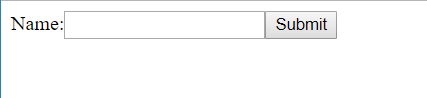
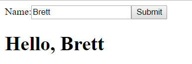

React JS
========

Introduction
------------
ReactJS is a JavaScript library used for building user interfaces. Its goal is to make it easier to change an interface at any point in time by dividing the user interface into a group of components. A large reason it has become so popular is because of its higher efficiency and less complexity of other competitors such as Angular and Vue. It is also a project that benefits from being created and backed by Facebook. Due to React's combination of flexibility, ease of use, and efficiency, it is a highly used and demanded skill for jobs that work with modern web applications.

History
-------
ReactJS originally started as a Javascript port of XHP, a version of PHP created by Facebook. The problem was to have dynamic web applications, it requires many trips to the server, which is not ideal for XHP. So, a Facebook engineer, Jordan Wilke, took it to the browser using Javascript; the result being ReactJS. [ReactHistory]_ The library was first created in 2011 and was first used in Facebook's newsfeed. Later, Instagram also implemented the library. It was open sourced in May of 2013. In 2015, React Native was introduced. This was to make for easier development with Android and iOS development. [Timeline]_ At first, people were unsure of React, but to combat this, they wanted to spread the message on how React is stable. This was done by having a "React Tour" to hopefully 'turn haters in advocates'. [Timeline]_ Today, React is mainstream and new versions are being released regularly
	
How React is Used
-----------------
ReactJS works by storing the state of an application internally, then only re-rendering the content when the state changes. The largest piece of content in all React applications are called components. It renders some sort of output such as a button or input field. To write these components, a javascript function or class can be used. These components will correspond and change other interface elements.  In the tutorial I have prepared, I will show how a simple form and button can be created using components and how these componenets can change interface elements. [FullStackReact]_ Another important aspect of React are States. These allow components to change the interface based on events such as a button click.

To be able to use ReactJS, we will use Javascript; more specifically, a React extension called Javascript eXtension, known as JSX. This extension allows us to write JavaScript that looks like HTML. To see this, we can look at Listing 1, a simple Hello World component:

.. code-block:: text
  :caption: ReactJS Helloworld

  class HelloWorld extends React.Component {
    render() {
      return (
        <h1>Hello World</h1>
      );
    }
  }

Observing the code, it appears as though the render() function is returning HTML, however it is JSX. At runtime, the JSX is then translated to regular Javascript:

.. code-block:: text
	:caption: Javascript Helloworld Translation

	class HelloWorld extends React.Component {
	  render() {
	    return (
	      React.createElement(
		'h1',
		'Hello World'
	      )
	    );
	  }
	}

[FullStackReact]_

Tutorial
--------
To begin building a React app using HTML, the source of React needs to be set inside a ``
	    
	    
	  </head>
	  
Now, looking at the body, before the Babel script we must set ``
`` tags to tell where the elements should render in the Document Object Model (DOM). Next, we can create our form component using a ``constructor()``. Then, we set the initial state of the input value in line 10. We use ``props`` to allow for customization in case we need other forms. Also, in the constructor (Lines 12 and 13), we bind events to the component.

.. code-block:: HTML
	:caption: Initial Input State
	:linenos:
	
	  <body>
	    

	    

	
	</body>
	</html>

If done correctly, you should see a very simple form with one a textbox and button:

After entering a name, by clicking the Submit button, it will call the ``ReactDOM.render()`` function that will render the element ``<h1> Hello, {name}</h1>`` where ``{name}`` changes based on the ``state``. As previously mentioned, this is done where the ``"welcome"`` id is located. The page should look similar to this:

Advantages
----------
One of the biggest advantages React has over other libraries is that is uses a Virtual DOM. So, instead of changing the document in the browser, it does these changes on a DOM that is run from memory. [Hackernoon]_ Using the Virtual DOM, React determines which components have changed and only sends those changes to the browser's DOM instead of reloading the entire page. This makes for a boost in performance, which of course is the goal for all businesses and companies that have an online presence. Reduced page load time will help with Search Engine Optimization and improve app's rankings on Google search. [Medium]_ 
	
Another feature in React that helps with efficiency is its use of "Single way Data Flow." This means instead of the user interface element changing the model state, the model is updated first, then renders the user interface element. The changes are detected with a callback function, then those changes flow to the user interface. Using one-way data flow is easier to debug and more efficient than two-way data flow. [Neuhaus]_

Disadvantages
-------------
Of course, there are always some disadvantages with any system. A couple commonly discussed downsides with React is its limitation of documentation. It hasn't been around as long as other libraries such as Angular, but Vue is newer and is already doing better in this aspect. React needs to figure out how to fix its lack of information on how to use and implement it. Another question surrounding React is its dependence on external libraries. Sometimes we see React depend on too many libraries, which could affect performance. [Medium]_

Future of React
---------------
React's primary competitors in the library and framework market are Angular and Vue. The biggest difference between Angular and React is that Angular is more of a framework because of its structure. It is a "complete solution", meaning it is easier to start working instead of having to figure out libraries and packages. On the other hand, React and Vue are more flexible. Their libraries work with many different types of packages. There aren't many rules or guidance with these libraries, so it may be easier to run into problems than with Angular. However, out of the three, Angular has the steepest learning curve. The easy setup is beneficial, but it may be hard to understand what is going on within the pre-existing code. Another important note is that right now many believe Vue is the easiest to use because of the code readability and overall simplicity. [Neuhaus]_

Putting all the advantages and disadvantages aside, React has beaten out its competitors in terms of market demand. As of June 2018, 28% of job postings have mentioned React while the next closest is Angular with 6.5%. React is also easily leading in the amount of NPM downloads at over 500 thousand compared to around 50 thousand. [Hackernoon]_

Conclusion
----------
React is a library that we are only getting started exploring and learning its capabilities. Its efficiency makes it desireable for companies. Simply put, the advantages out weigh the disadvantages. As proven by its market demand, it is a skill that is important to know for modern web application development and will not be going away in the foreseeable future.

Sources
-------
.. [FullStackReact] Lerner, Ari "`30 Days of React: What is React? <https://www.fullstackreact.com/30-days-of-react/day-1/>`_" Fullstack React, 2017. Web. 2 April 2019.

.. [ReactHistory] Dawson, Chris "`Javascript's History and How it led to ReactJS <https://thenewstack.io/javascripts-history-and-how-it-led-to-reactjs/>`_" The New Stack, 25 July 2014. Web. 4 April 2019. 

.. [Hackernoon] Kostrzewa, Denis "`Is React.js the Best Javascript Framework in 2018? <https://hackernoon.com/is-react-js-the-best-javascript-framework-in-2018-264a0eb373c8>`_" Hacker Noon. Hacker Noon, 19 July 2018. Web. 8 April 2019.

.. [Medium] Mahmood, Hamza "`Advantages of Developing Modern Web apps with React.js <https://medium.com/@hamzamahmood/advantages-of-developing-modern-web-apps-with-react-js-8504c571db71>`_" Medium. Medium, 27 May 2018. Web. 15 April 2019.

.. [Neuhaus] Neuhaus, Jens "`Angular vs. React vs. Vue: A 2017 Comparison <https://medium.com/unicorn-supplies/angular-vs-react-vs-vue-a-2017-comparison-c5c52d620176>`_" Medium. Medium, 28 August 2017. Web. 20 April 2019.

.. [Timeline] Papp, Andrea "`The History of React.js on a Timeline <https://blog.risingstack.com/the-history-of-react-js-on-a-timeline/>`_" Rising Stack. Rising Stack, 4 April 2018. Web. 20 April 2019.
