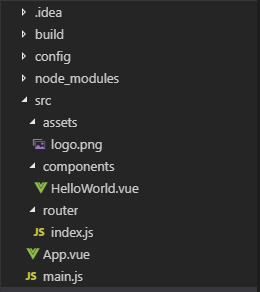

Vue- KDL
========

Why use Vue.js and Installation
-------------------------------

Vue.js is a progressive framework built in Javascript that can build
single paged application. It is also versatile and can be integrated
into existing web pages. One of the
biggest advantages of Vue is the ability to integrate and embed it into
existing web projects. It is used only for front end development and is easy to
learn using existing syntax pre-ES2015/ES6 standards. Vue.js is a great
framework for people wanting to learn front-end development and
for advanced users.
[WhatIsVue]_

The person behind the initial development behind Vue.js was Evan You. Evan
originally worked at Google building web applications. He especially worked
with the Angular front-end framework. He liked the framework so much, but he
always felt like it was too resource heavy. Evan wanted to keep building web
apps while using similar syntax as Angular. He then started the development
of Vue.js. He decided to publish his work and made it to the front page of
Hacker News. Vue.js became popular due to its ease of use. It's a framework
that is easy to learn but has enough to challenge to master.
[HistoryOfVue]_

Vue is similar to other frameworks, such as React in terms of the utilization
of a virtual DOM and reactive components. Vue does perform better when it comes
to rendering. It will render sub-components automatically since components
are automatically tracked. In React, developers have to add additional keywords
to avoid renders of the whole DOM. Vue achieves will only render the
necessary components when changed.

Recently, Vue.js became the most popular front-end framework on
Github in the terms of stars. One of the reasons Vue.js has picked up
in speed in the last few years is due to its easy learning curve. It offers
the ease of vanilla javascript syntax that most front-end developers are
acclimated to. Other modern frameworks such as React and Angular require
the knowledge of ES6 javascript, which has not yet been widely adopted.

Vue.js is also grabbing developer's attention through its flexibility of being
adapted into current web applications. Vue.js has the range to be used to
build new applications or add onto existing web pages. Since its so flexible,
developers can feel comfortable to use it at any level.

Vue.js is also light-weight framework compared to its counter-parts.
A majority of users will leave a website if it takes more than three seconds
to load the web application. Vue.js ensures a smooth experience for the user
with a fast bootup time. [Popularity]_

It is possible to use Vue.js without installing it by using their
CDN in a 

    

Typically .vue files have three parts: template, script, and style.
This file represents a component. It has a template and the script attached
to it. Newer to Vue.js is the ``<router-view/>``. This is a special element
that takes a peek at the index.js in the router folder of the project:

.. code-block:: javascript
    :Caption: index.js

    import Vue from 'vue'
    import Router from 'vue-router'
    import HelloWorld from '@/components/HelloWorld'

    Vue.use(Router)

    export default new Router({
      routes: [
        {
          path: '/',
          name: 'HelloWorld',
          component: HelloWorld
        }
      ]
    })

Whatever the current path is, it takes a look at the name and components
and loads the appropriate components. The HelloWorld.vue file would be
loaded into the root level of the application. [Tutorial]_

Conclusion
----------
If you are looking to enter the world of front-end development, then Vue.js
is a great way to start learning. As seen in several examples listed
in this article, anyone who has basic html and javascript knowledge can
start Vue.js today. For advanced users, they can also use Vue.js to build
lightweight applications. New users can use the CDN to use Vue.js and advanced
users can use Vue-CLI and Webpack to build larger applications. The biggest
advantage that Vue.js has over other frameworks is the ability to
be adopted at any level of an application, from the ground up or it can
be incorporated into current applications.

Citations
---------
.. [WhatIsVue] “`Introduction - Vue.js. <http://www.vuejs.org/v2/guide/index.html#What-is-Vue-js>`_”
    Vue.js, n.d. Web. 11 Apr. 2019.

.. [HistoryOfVue] Evan You "`First Week of Launching Vue <https://blog.evanyou.me/2014/02/11/first-week-of-launching-an-oss-project/>`_"\
    Blog, 11 Feb. 2014, Web. 28. Apr. 2019

.. [Installation] “`VueJS Environment Setup. <https://www.tutorialspoint.com/vuejs/vuejs_environment_setup.htm>`_”,
    Tutorials Point, n.d. Web. 4 Apr. 2019.

.. [Popularity] Nowak, Maja. “`Reasons Why Vue.js Is Getting More Traction Every Month. <www.monterail.com/blog/reasons-why-vuejs-is-popular>`_”, Monterail, 19 Dec. 2018, Web. 28 Apr. 2019.

.. [Tutorial] Eschweiler, Sebastian.
    “`Vue.js 2 Quickstart Tutorial 2017. <https://medium.com/codingthesmartway-com-blog/vue-js-2-quickstart-tutorial-2017-246195cfbdd2>`_”,
    CodingTheSmartWay, Medium, 7 Jan. 2017, Web. 11 Apr. 2019.

