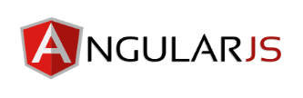
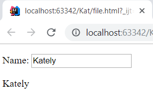
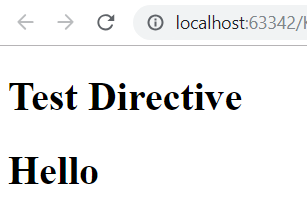

AngularJS
=========

AngularJS is a JavaScript front-end framework program that helps with the
development process. Building dynamic single page applications that are
interactive and versatile and best for professionals. Angular might take people
longer to learn than other frameworks, but if you are developing a data-driven,
large-scale application with complex logic, it allows you to work on the logic
and get a great running page in the browser. Overall AngularJS is a program
that allows you to design large scale frameworks all while minimizing the code
that the coder must write due to how the program works.

What is AngularJS and the history of it
---------------------------------------

AngularJS version 1.0 was released in 2012.
Miško Hevery, a Google employee, started to work with AngularJS in 2009.
The idea turned out very well, and the project is now officially supported by Google. [Huszárik]_

When learning AngularJS you should already know HTML, CSS, and JavaScript.

.. code-block:: html
   :caption: AngularJS is written in JavaScript.

    <!-- AngularJS is used in a JavaScript file and need this tag -->
   

MVC Framework
-------------

Model View Controller is a web application software made up of three parts. The
first level is simple script which maintains the data, is called the model. The
view is how the data is presented on the screen and how that data changes by
the user moving on the screen. The controller interacts with both the model and
the view. The controller happens in the view and checks it with the model. It
then updates the web application. [Lau]_ [Ray]_

Interface HTML
--------------

Using HTML for the user interface simplifies app development and keeps the code
easy to understand and well structured. HTML makes it easy to understand the
style of the tag. HTML is a declarative language that makes it simple to
organize and less likely to break, unlike other app development software that
uses JavaScript Interfaces. AngularJS and HTML can find what you want with
dependencies making it a lot easier to understand program flow and loading.
[Lau]_ [Ray]_

POJO
----

POJO stands for plain old JavaScript and this goes back to the model part of MVC
in which AngularJS binds pieces together without using a getter or setter.
Objects can have loops created with properties, which developers can then make
changes directly to the loop and adjust the reframe, making the code
cleaner and more precise. POJO is different than traditional data models because
Angular’s data model has a middle holding area that works with the controller
and the view to collect data from the user. The middle area stores data and
looks for changes to the stored data, along with updating the view spontaneously.
[Lau]_ [Ray]_

Two-way binding
---------------

Two-way binding makes the application process simpler, along with difficult
manipulations and calculations. The view and the model work together with data
to make them sync automatically. With AngularJS you can bind different elements
and in the correlation, the view and the model will still work together and keep
the page updated correctly. [Ray]_

Filters
-------

Filters can be used to do formatting of numbers and arrays based on specific
parameters that can standalone. A standalone function is useful to have when
creating an app to keep your code clean and organized. AngularJS will also let
create your own filter just like the directive
``app.filter('newFilter', function()`` filer examples [w3schools]_ [Lau]_

* currency

* data

* filter

* json

* limitTo

* lowercase

* number

* orderBy

* uppercase

``
The name is {{ lastName | uppercase }}
``

The filter filer will return anything in the array containing the item that was
being searched through. For example if you had a list of name and searched the
letter 'b' it would return everything with the letter 'b'. [w3schools]_

Routing
-------

Routing is important to the single page applications (SPA) and updating from one
view to the next. Developers don't want to load a whole new page when something
is clicked so they us the same page and just change the URL.
With AngularJS, changing views becomes easier with single page applications.
Routing is what happens when the user changes the view on the screen and the new
page should load while changing the URL. This method should make the user think
they are interacting with the site. For example, when you are on a website and
you select the menu button it should be like you are interacting with the page,
rather than loading a whole new page when you just want to access the menu
button on part of the page. With AngularJS you can create multiple views for
URLs allowing the website transition from one view to another seamlessly. [Ray]_

.. code-block:: html
    :caption: ngRoute

    <!-- The $routeProvider will have the different routes to your page -->
    

Directives
----------

Directives is creating a unique tag specific to your code and should be a
standalone element that is separate from the app. This tag can be used anytime
once it is defined and will work similarly, just like any other tag in HTML.
Creating a new element is possible by putting the DOM manipulation code into
directives and give them custom attributes and class names. MVC app can now look
directly and the new data and update it with the view. [Lau]_

Extending HTML
~~~~~~~~~~~~~~

In this example of code AngularJS works with the HTML using ``ng-directives``.
The code applies AngularJS with adding ``ng-app=""`` to the div tag. Next in the
input field ``ng-model`` binds the application data which is name to the
``ng-bind`` binds is the view we see on the screen. [w3schools]_

.. code-block:: html
    :caption: ng-directives with HTML

    <!DOCTYPE html>
    <html>
    
    <body>

    

        
Name: <input type="text" ng-model="name">

        

    

    </body>
    </html>

Creating Directives
~~~~~~~~~~~~~~~~~~~

A directive can be created for elements, classes, and attributes. This simple
example will be for an element name that will print out a ``<h1></h1>`` tag, but
with the functions you are able to do more complex things. One thing to be
careful with is the name of the function and the tag that must follow correctly
for to work. The tag should use - to separate the words and the function name
should the same just camel case. [w3schools]_

.. code-block:: html
    :caption: creating a directive

    <!DOCTYPE html>
    <html>
    
    <body ng-app="myApp">

    <h1>Test Directive</h1>
    

    <test-directive></test-directive>

    </body>
    </html>

DOM
---
Document Object Model (DOM) adds behaviors, and with Angular it should be inside
directives. Therefore, the user interface designers can see the view without all
of the behaviors. [Lau]_

.. code-block:: html
    :caption: HTML DOM elements

    <!-- This is a simple example but could be added to a button-->
    

    
I am not visible.

    
I am visible.

    

.. [w3schools] "`AngularJS Tutorial <https://www.w3schools.com/angular/default.asp>`_" W3Schools, Web. 4 Apr. 2019
.. [Lau] "`sitepoint <https://www.sitepoint.com/10-reasons-use-angularjs/>`_" sitepoint, 05 Sept. 2013. Web. 4 Apr. 2019
.. [Ray] "`Why AngularJS is my preferred framework for software development <https://medium.freecodecamp.org/why-is-angularjs-the-most-preferred-framework-for-software-development-5253c2c569c9/>`_" freeCodeCamp, 16 Jul. 2018. Web. 4 Apr. 2019
.. [Huszárik] https://blog.risingstack.com/angularjs-to-angular-history-and-tips-to-get-started/
