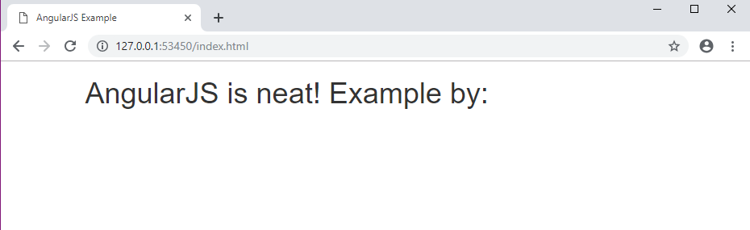
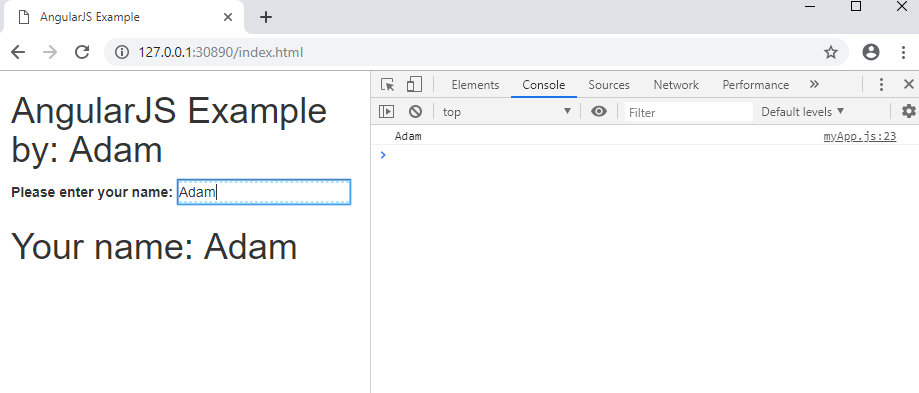

AngularJS
======================

Introduction
------------

JavaScript is a programming language that is designed to enhance web applications.
Since the release, programmers have been learning and adding to the pool of
frameworks that make writing code even easier. AngularJS was one of those
frameworks that has proven to be a very powerful tool that has the ability to two
way bind data, create beautiful single page applications, and provides tons of
functions for the programmer making the javascript cleaner.

History
~~~~~~~

AngularJS was created initially by two Google employees: Misko Hevery and Adam
Abrons. The two employees originally called the framework 'GetAngular' which
would give web programmers more interaction between the front and back end of the
application.

Eventually Hevery had to work on a different project for Google called Feedback.
over the course of 6 months there was 17,000 lines of code written for this program
which became increasingly difficult to test. This drove Hevery to rewrite the
software but this time using his part of the GetAngular project from earlier. With
GetAngular he was able to turn the initial 17,000 lines of code into just 1,500
in 3 weeks. With this massive rework and elimination of lines of code his manager
took interest in GetAngular which would lead Google to start heavily development
into Angular.js. [Austin]_ AngularJS over the years would turn into a framework
monolith in the javascript community. The ability to creat single page applications in
just a couple hundred lines of code is incredible.

MVC (Model, View, Controller)
-----------------------------

A Model-View-Controller architecture is a design pattern for software engineers
to help separate the functionality of a application. The application can be
separated into 3 main sections.

Model
~~~~~

This section handles how the user data is handled. The data could come from
the user or a database. The Model could be considered the javascript or any
language that will do logical manipulation.

View
~~~~

The view section is responsible for handling anything the user will visually see.
The user interface logic could get data from the controller and send data to the
model. The View is usually the HTML.

Controllers
~~~~~~~~~~~

The controllers of the MVC architecture act as a interface for the view and model
sections. The controller will manipulate data that has came from a model or some
other source and send it back to the model and view [Tutorialspoint]_.

AngularJS MVC
~~~~~~~~~~~~~

.. image:: pictures/AngularJSwebsite.PNG
    :width: 800
    :alt: Download Button for AngularJS [Angular]_

Starting development in AngularJS is simple and easy. Going to `Angularjs.org <https://angularjs.org>`_
and finding what version of AngularJS you want is simple. When you find the version you
want to start developing in all you need to do is grab the URL of the file and stick it
in your HTML file. [Angular]_

.. code-block:: html
	:caption: Adding the script for AngularJS

	

Then you need to be worried about the global namespace that Angular uses. The
framework has tons of preset global variables which could interfere with your
javascript.

Global Namespace
~~~~~~~~~~~~~~~~

While creating a HTML document you can incorperate many javascript libraries
to enhance the document. One fear is that the javascript can override each other
if they share similar named variables in their global namespace. consider the
following examples:

.. code-block:: javascript
    :caption: Global Namespace Example 1

    var person = 'Adam';
    var class = 'Advanced Web Development';

    function getInfo(){
        return person + ' ' + class;
    }

.. code-block:: javascript
    :caption: Global Namespace Example 2

    var person = 'Mike';

    getInfo();

The function in the beginning declares person as 'Adam' but prints 'Mike' when the
function is called in the 2nd file. This is because of the global namespace.
This is very important to know and understand before delving to far into AngularJS.
As mentioned before AngularJS comes with a ton of pre-defined variables in the
global namespace which can get messy and cause errors and bugs. To combat this
the user will have to create their own namespace. One way is to create your own
namespace by treating globals you may want to use as a JSON variable.

.. code-block:: javascript
    :caption: JSON namespace

    var myNamespace = {};

    myNamespace.person = 'Mike';

    getInfo();

This Example will no longer use the global namespace in the first example and
the function should now return 'Adam' as intended. This concept will be very
important for dealing with AngularJS. [Alicea]_

Bring in AngularJS Features
~~~~~~~~~~~~~~~~~~~~~~~~~~~

AngularJS offer's so many features that it makes development easy. In Angular
the MVC is easy to understand with just a little example.

.. code-block:: html
    :caption: Making your HTML document a AngularJS Model

    // This is the View
    <html lang="en-us" ng-app="myApp">

Adding the 'ng-app' is Angular's way of specifying a model/module the programmer will
be able to control in javascript. You can name it what ever you want, it just
has to be the same name in the javascript.

.. code-block:: javascript
    :caption: Javascript of declaring a AngularJS Module

    // This is Model
    // The [] in the parameters is a array of dependencies for Angular to work
    // with. I will discuss this later.
    // The first parameter is the name you used in the HTML attribute ng-app
    var myApp = angular.module('myApp', []);

This code will create a variable which is like the DOM. This variable will
be how you control the specified HTML document. Now you may want to manipulate it
somehow. This is where the controller part of the MVC comes in.

.. code-block:: javascript
    :caption: Javascript of declaring a Controller

    // This is the Controller
    myApp.controller('mainController', function(){});

And before this controller will work with anything you must hook it up somewhere
in the HTML.

.. code-block:: html
    :caption: HTML for connecting a Controller

    <!--This is where the controller in the myApp.js is connected to --->
    

Now you have a controller which you can write code in the function block in the
parameters and manipulate the DOM. This is a simplified version of the AngularJS
MVC model. Notice in the two code examples above that the ng-controller
attribute value matches the string in the 1st parameter in the javascript
code. [Alicea]_

What is AngularJS good for?
---------------------------

Data-Binding
~~~~~~~~~~~~

AngularJS is a fantastic framework for binding data in the javascript and the
HTML DOM. The user of a website can change something in the HTML via a textbox
or some field and it will directly change the javascript too. AngularJS makes this
easy! consider the following:

.. code-block:: html
    :caption: Sample HTML for data-binding

    <!DOCTYPE html>
    <html lang="en-us" ng-app="myApp">
        <head>
            <title>AngularJS Example</title>
            <meta charset="UTF-8">
        </head>

        <body>
            

                

                    <!-- Angular looks for {{}} and replaces it with anything
                    you want to put there. currently there is a
                    string called name in the middle of the curly braces
                    which will have to match name of the variable in the
                    javascript you wish to fill it with-->
                    

                        <label>Please enter your name:</label>
                        <input type="text" ng-model="name" />
                        <h1>Your name: {{name}}</h1>
                    

                

            

        </body>

    
    </html>

There is a lot going on in this sample code. in the container div there is a
'ng-controller' attribute which we will link to the javascript so we can start
manipulating the DOM. This code will connect the two together:

.. code-block:: javascript
    :caption: Connecting to the DOM with AngularJS

    myApp.controller('mainController', ['$scope','$timeout',function($scope,$timeout)
        $scope.name='';
        //$timeout is AngularJS service that can wait x amount of milliseconds
        //before performing a function, in this case I wanted to demo how
        //the two way data binding worked
        $timeout(funtion(){console.log($scope.name},5000);
    )]);

A question that may arise is what is '$scope'. It is important to know that
AngularJS prefixes all their variables with either $ or $$ so that the programmer
can include more frameworks if they wish. This would help mitigate conflicting
names. The $scope variable represents a service offered by AngularJS. There are
a whole collection of services that are offered and can be found at `Angularjs.org <https://angularjs.org>`_
for documentation. The $scope is how Angular 'talks' to the DOM.

Single Page Application (SPA)
~~~~~~~~~~~~~~~~~~~~~~~~~~~~~

Creating a multi-page application can be difficult and costly on the client's
browser and the server serving the web pages. AngularJS solves this problem
by dynamically changing the users view in the same web page. This eliminates
the need to get another web page from the server and doesn't bring along the
annoying page stuttering when navigating to a different page.

AngularJS bundles all the code and views into one package and will dynamically
load code based on what view the user is currently in. This makes the work load
lighter on the server which speeds the website up significantly. Angular takes
advantage of the client's computer to load the information on the website.

Testing the web application also becomes much easier when there is only one page
to test. This will allow testing suites to more easily test the web application
when the development team deploys a new build. This also means rolling back
changes is also easy, since everything is bundled together.  [Rajput]_

Chaining Promises = Complicated
~~~~~~~~~~~~~~~~~~~~~~~~~~~~~~~

AngularJS has some really incredible services and features, one of them being
the ability to chain functions together with a concept called called promises.
This is important because javascript is asynchronous and you aren't really
guaranteed an order of operation in some parts of the code. AngularJS can handle
many events that may transpire while getting information over some kind of call
over the internet. Here is a very simple example:

.. code-block:: javascript
    :caption: Exmaple of Promise chaining

    function returnStudentMajors(){
    return $http.get("Some url to get data")
        .success(function(data){
            //do something
        })
        .error(function(data){
            //do someting
        })
    }

This is a simple use of a promise but it can get really complicated when you start
chaining them together as follows:

.. code-block:: javascript
    :caption: Exmaple of Promise chaining

    $http.get("Some url to get data").then(function(data){
        //do something
    }).then(function(data){
        //do something
    }).then(function(data){
        //do something
    });
    //You can chain this for as long as you have stuff to do on the data

It is not important to understand what the $http service is doing in this example,
but how the chaining can go on and on because every call returns an
object which the programmer can call methods from the returned object.
Some chains can get very complex but it can be very powerful. [Strahl]_

Disadvantages of AngularJS
--------------------------

AngularJS has a lot of complexity to the framework. One of the annoyances is
having to allow javascript on your browser to be able to see the AngularJS
application. With out javascript permissions the page will simply not load.
Another major complexity will be the hierarchy of directives that the programmer
will have to learn to make optimal use of AngularJS.

AngularJS uses a MVC concept to create single page applications which could be
very intimidating and hard if the programmer is not familiar with the concepts
before hand. Another confusing aspect is keeping the scopes organized between
the views in the web application. Each scope will contain different information
depending on what view the user is currently in. [Rajput]_

Sources
-------

.. [Alicea] Anthony, Alicea “`Master AngularJS (Essential JavaScript Concepts) <https://www.udemy.com/learn-angularjs>`_ ” Udemy, Anthony Alicea, Web 4/9/2019

.. [Angular] Angular.io "`Architecture overview <https://angular.io/guide/architecture>`_ "version 7.2.12-local+sha.d727561, Google, Web 4/2/2019

.. [Tutorialspoint] Tutorialspoint.com "`AngularJS - Overview <https://www.tutorialspoint.com/angularjs/angularjs_overview.htm>`_ "Web 4/2/2019, Tutorialspoint.com "`MVC Framework - Introduction <https://www.tutorialspoint.com/mvc_framework/mvc_framework_introduction.htm>`_ "Web 4/4/2019

.. [Austin] Andrew Austin “`An Overview of AngularJS for Managers. <https://andrewaustin.com/an-overview-of-angularjs-for-managers/>`_” Andrew Austin, 14 Aug. 2014

.. [Strahl] Strahl, Rick. “`AngularJs and Promises with the $Http Service. <https://ieeexplore.ieee.org/document/7550838/>`_ ” Rick Strahl's Web Log, Rick Strahl, Web 4/10/2019

.. [Rajput]  Rajput, Mehul “`The Pros and Cons of Choosing AngularJS. <https://jaxenter.com/the-pros-and-cons-of-choosing-angularjs-124850.html>`_ ” JAXenter, 21 Mar. 2016