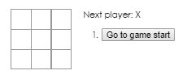
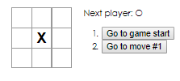
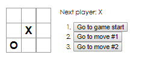
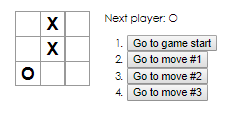
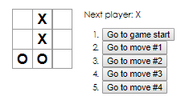
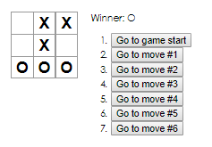
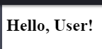

ReactJS Project
======================

Outline
-------
* Introduction - What the topic is about. Cover highlight points.
* Last sentence should be a thesis statement!
* What is ReactJS, why the UI Library is popular?  

* History of ReactJS / Library of Code
    * Paragraph 1
    * Paragraph 2
    * Paragraph 3

* ReactJS Example Code
    * Paragraph 1
    * Paragraph 2
    * Paragraph 3

* ReactJS Notable Features
    * Paragraph 1
    * Paragraph 2
    * Paragraph 3

* Reception of ReactJS
    * Paragraph 1
    * Paragraph 2
    * Paragraph 3

* ReactJS Internationalization
    * Paragraph 1
    * Paragraph 2
    * Paragraph 3

* Conclusion

Introduction to ReactJS
-----------------------
ReactJS is a JavaScript library that specializes in building user interfaces.
This JavaScript library makes it easy to create user interfaces for your
programming application or to update and render the proper components in your
application change correctly. In ReactJS, you are able to use declarative views
which makes your code easier to read and to debug. ReactJS is a component based
JavaScript library that focuses on building encapsulated components that are
able to manage their own state which can help the user compose some of the most
easiest or most complex user interfaces.

Over the years, several social media platforms like Facebook and Instagram have
endorsed the JavaScript library and have implemented it into their applications.
However, within the last five years the development of the this library has come
under scrutiny. Disputes started to arise over Facebook's licensing agreement
with the ReactJS and how the user agreement was specifically written. The terms
and conditions for the JavaScript library made it so that you had the inability
to sue Facebook and its subsidiaries, but Facebook and its subsidiaries could
sue you for patent infringement, if that issue were to arise.

Since this JavaScript library is open sourced, it made it difficult for
developers to want to work with ReactJS. Developers feared that even if they
tinkered with the library, that they could be sued by Facebook for patent
infringement, which was never the developer's intent. Even though ReactJS has
had its issues in the development world, its benefits to creating simple UI's is
something most individuals so realize before judging the JavaScript library.

History of ReactJS
------------------
ReactJS began in 2011 with a couple of software engineers from Facebook. One of
those engineers was Jordan Walke who helped integrate ReactJS into Facebook's
news feed style set up. After ReactJS was implemented into Facebook's news feed
set up, Instagram followed suit as well adding ReactJS to their application as
well a year later in 2012. After the two social media giants endorsed this
JavaScript library, the code was open sourced to the public in 2013.

Pete Hunt is another software developer that has been a core member of the
ReactJS software development team. In an interview with [InfoWorld]_, Hunt
discusses the shift that reactive programming has underwent in the last few
years. Hunt stated "We've seen a shift toward what we like to call reactive
programming. Meteor and Angular are examples of that. When your data updates,
your UI is automatically updated to reflect that, and the system manages that
for you. The difference with React is the way that you program it is much more
like a game engine, as opposed to these alternative approaches, with
data binding". Hunt was able to describe how different ReactJS is
compared to other JavaScript libraries.

When it comes to ReactJS, the developers for the library wanted it to have a
different look and presence compared to other popular UI developing languages.
ReactJS makes it look like you are coding for a game engine and tries to use
syntax that might help the programmer understand what he or she is trying to
code.

ReactJS Example Code
--------------------
Tic-Tac-Toe Tutorial
~~~~~~~~~~~~~~~~~~~~
This particular block of code derives from the ReactJS tutorial. This code lets
the user create and interact with a tic-tac-toe board. This particular block of
code is organized into different classes.

.. code-block:: text
    :caption: Starting Tic-Tac-Toe: Square & Board Functions

    function Square(props)
    {
        return(
        <button className="square" onClick={props.onClick}>
        {props.value}
        </button>
        );
    }
    class Board extends React.Component
        {
            renderSquare(i)
            {
                return (
                <Square
                value={this.props.squares[i]}
                onClick={() => this.props.onClick(i)}
                />
                 );
            }
        }
    }

From this code block the user is able to create a function that allows the user
click a button once the game begins. The Board class is then created which calls
the Square function which allows the user to click a square within the game
board. By clicking one of these squares, a user either puts down an X or an O
within the square selected.

.. code-block:: text
    :caption: Starting Tic-Tac-Toe: Creating 3x3 Array

    render()
        {
        return (
            

            

                {this.renderSquare(0)}
                {this.renderSquare(1)}
                {this.renderSquare(2)}
            

            

                {this.renderSquare(3)}
                {this.renderSquare(4)}
                {this.renderSquare(5)}
            

            

                {this.renderSquare(6)}
                {this.renderSquare(7)}
                {this.renderSquare(8)}
            

            

            );
        }

    class Game extends React.Component
        {
            constructor(props)
                {
                    super(props);
                    this.state =
                        {
                             history: [{
                                squares: Array(9).fill(null)
                                }],
                        xIsNext: true
                        };
                }
        }

This particular code block creates the array for the tic-tac-toe board. This
board is based off of a three by three array with nine different squares. All
nine squares are used to simulate one bigger square, thus creating the tic-tac-
toe board.

Board Example
~~~~~~~~~~~~~
This is a visual model of what the two code blocks above produce. This code was
able to create a tic-tac-toe board that the user or user can interact with.

Player Input Code
~~~~~~~~~~~~~~~~~
This block of code allows the user to interact with the game board. The first
user has the ability to select a box with the X marker. Once the user has
completed her selection, the second user will have the ability to select their
box as well. The second user will select a box with an O marker.

.. code-block:: text
    :caption: Handling User Input

    handleClick(i)
    {
        const history = this.state.history;
        const current = history[history.length - 1];
        const squares = current.squares.slice();
        if (calculateWinner(squares) || squares[i])
            {
                return;
            }
        squares[i] = this.state.xIsNext ? 'X' : 'O';
        this.setState(
            {
                history: history.concat([
                    {
                        squares: squares
                    }]),
                xIsNext: !this.state.xIsNext,
            });
    }

    render()
    {
        const history = this.state.history;
        const current = history[history.length - 1];
        const winner = calculateWinner(current.squares);

        const moves = history.map((step, move) =>
        {
            const desc = move ?
            'Go to move #' + move :
            'Go to game start';
          return (
            <li key={move}>
            <button onClick={() => this.jumpTo(move)}>{desc}</button>
            </li>
            );
        });
    }

After the user has the ability to click on the boxes, a winner and a loser has
to be implemented into the game. In order for this to happen, the user has to
create this code block. This particular block of code uses if statements to
determine if the user has either one the game or has to keep playing. For the
game to find out who the winner is, an array must be put in place that is able
to calculate how a user wins. In tic-tac-toe, you can win by getting three X's
or O's in a row. To recognize this, this code block detects that once the user
gets three in a row, the game will declare a winner.

.. code-block:: text
    :caption: Declaring the Winner & Loser

    let status;
    if (winner)
        {
            status = 'Winner: ' + winner;
        }
    else
    {
        status = 'Next player: ' + (this.state.xIsNext ? 'X' : 'O');
    }

    return
        (
        

            

             <Board
                squares={current.squares}
                onClick={(i) => this.handleClick(i)}
                />
            

            

                
{status}

                <ol>{moves}</ol>
            

      

    );
    }

    // ========================================

     ReactDOM.render
        (
         <Game />,
        document.getElementById('root')
        );

    function calculateWinner(squares)
    {
    const lines = [
        [0, 1, 2],
        [3, 4, 5],
        [6, 7, 8],
        [0, 3, 6],
        [1, 4, 7],
        [2, 5, 8],
        [0, 4, 8],
        [2, 4, 6],
    ];
    for (let i = 0; i < lines.length; i++)
      {
        const [a, b, c] = lines[i];
        if (squares[a] && squares[a] === squares[b] && squares[a] === squares[c])
         {
            return squares[a];
         }
      }
    return null;
    }

Player Input Example
~~~~~~~~~~~~~~~~~~~~
Once all of these code blocks are implemented, the game will work properly. The
tic-tac-toe game allows the user to switch back and forth until a winner is
declared or the game ends in a tie. Here is an example of how a typical game
would look like if the user were to win the game.

.. image:: board5.PNG
    :width: 25%

ReactJS Notable Features
------------------------
When it comes to ReactJS there are some distinguishable features that the
JavaScript library has. One of these features would be the [ReactJSComponents]_.
Components in ReactJS are able to split up the user interface into independent
reusable pieces. Components are similar to JavaScript functions. Components are
able to accept inputs and return elements that are able to describe to the user
what they should be seeing on their screen. Here is an example of what a simple
component looks like.

.. code-block:: text
    :caption: Simple Component Example

    function Welcome(props)
        {
            return <h1>Hello, {props.name}!</h1>;
        }

    const element = <Welcome name="User" />;
    ReactDOM.render(element, document.getElementById('root'));

Another notable feature of ReactJS would be the [ReactJSRefs]_. Refs in ReactJS
are able to

Another notable feature in ReactJS would be the [ReactJSSpecifications]_. The
specifications in ReactJS are able to

Reception of ReactJS
--------------------
Here is an in-text citation to [TheNewStack]_
Here is an in-text citation to [InfoQ]_
Here is an in-text citation to [Medium]_
Here is an in-text citation to [FacebookCode]_
Here is an in-text citation to [TechCrunch]_

ReactJS Internationalization
----------------------------

Conclusion
----------
Sub Heading
~~~~~~~~~~~

Citations
---------
.. [ReactJS] "`Tutorial: Intro to React <https://reactjs.org/tutorial/tutorial.html>`_"
    React. Facebook Inc, Web. 4 Apr. 2019.

.. [ReactJSComponents] "`Components and Props <https://reactjs.org/docs/components-and-props.html#props-are-read-only>`_"
    React. Facebook Inc, Web. 4 Apr. 2019.

.. [ReactJSRefs] "`Refs and the DOM <https://reactjs.org/docs/refs-and-the-dom.html>`_"
    React. Facebook Inc, Web. 4 Apr. 2019.

.. [ReactJSSpecifications] "`Draft: JSX Specification <https://reactjs.org/docs/refs-and-the-dom.html>`_"
    JSX, Facebook Inc, Web. 4 Apr. 2019.

.. [InfoWorld] Krill, Paul. "`React: Making Faster, Smoother UIs for data-driven Web Apps <https://www.infoworld.com/article/2608181/react--making-faster--smoother-uis-for-data-driven-web-apps.html>`_"
    InfoWorld Tech Watch, InfoWorld, Web. 15 May 2014.

.. [TheNewStack] Dawson, Chris. "`JavaScript's History and How it Led to React JS <https://thenewstack.io/javascripts-history-and-how-it-led-to-reactjs/>`_"
    The New Stack Technology, The New Stack, Web. 25 Jul. 2014.

.. [InfoQ] Hemel, Zef. "`Facebook's React JavaScript User Interfaces Library Receives Mixed Reviews <https://www.infoq.com/news/2013/06/facebook-react>`_"
    InfoQ News, InfoQ, Web. 3 Jun. 2013.

.. [Medium] Berkana. "`A Compelling Reason Not to Use ReactJS <https://medium.com/bits-and-pixels/a-compelling-reason-not-to-use-reactjs-beac24402f7b>`_"
    Bits and Pixels, A Medium Corporation, Web. 24 May 2015.

.. [FacebookCode] Pearce, James. "`Updating Our Open Source Patent Grant <https://code.fb.com/open-source/updating-our-open-source-patent-grant/>`_"
    Facebook Code, Facebook Inc, Web. 10 Apr. 2015.

.. [TechCrunch] Lomas, Natasha. "`WordPress to Ditch React Library Over Facebook Patent Clause Risk <https://techcrunch.com/2017/09/15/wordpress-to-ditch-react-library-over-facebook-patent-clause-risk/>`_"
    TechCrunch News, TechCrunch, Web. 8 Apr. 2017.
