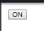
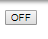
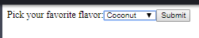

ReactJS Project
======================

Introduction to ReactJS
-----------------------
ReactJS is a JavaScript library that specializes in building user interfaces.
This JavaScript library makes it so a programmer can create user interfaces for
their programming application or to update and render the proper components in
their application if changes are needed. In ReactJS, you are able to use
declarative views which makes your code easier to read and to debug. ReactJS is
a component based JavaScript library that focuses on building encapsulated
components that are able to manage their own state which can help the user
compose some of the most easiest or most complex user interfaces.

History of ReactJS
------------------
ReactJS began in 2011 with a couple of software engineers from Facebook. One of
those engineers was Jordan Walke who helped integrate ReactJS into Facebook's
news feed style set up. After ReactJS was implemented into Facebook's news feed
set up, Instagram followed suit as well by adding ReactJS to their application
a year later in 2012. After the two social media giants endorsed this
JavaScript library, the code was open sourced to the public in 2013. Pete Hunt
is another software developer, like Jordan Walke, who has been a core member of
the ReactJS software development team.

In an interview with [InfoWorld]_, Hunt discusses the shift that reactive
programming has undergone in the last few years. Hunt stated "We've seen a shift
toward what we like to call reactive programming. Meteor and Angular are
examples of that. When your data updates, your UI is automatically updated to
reflect that, and the system manages that for you. The difference with React is
the way that you program it, is much more like a game engine, as opposed to
these alternative approaches, with data binding". From this quote, Hunt
describes that even though these JavaScript libraries are similar the way they
are created syntactically is different, which gives ReactJS a leg up on other
competitors.

According to the [TheNewStackArticle]_, developers from ReactJS also helped
minimize malicious Cross Site Scripting (XSS) attacks that occur within the
JavaScript language. XSS attacks occur when an attacker enters content that is
embedded or hidden within the JavaScript code that is intended to steal or
compromise the viewer's information. To prevent these attacks, ReactJS was able
to scrub the viewers submitted information, making it so that the attacker comes
up empty handed.

When it comes to ReactJS, the developers for the library wanted it to have a
different look and presence compared to other popular UI developing languages.
ReactJS makes it look like you are coding for a game engine and tries to use
syntax that might help the programmer understand what he or she is trying to
code.

ReactJS Tic-Tac-Toe Tutorial
----------------------------
This particular block of code derives from the [ReactJSTutorial]_. This code
lets the user create and interact with a tic-tac-toe board. This particular
block of code is organized into different classes. Here is an example of how the
first couple of functions operate.

.. code-block:: text
    :caption: Starting Tic-Tac-Toe: Square & Board Functions

    function Square(props)
    {
        return(
        <button className="square" onClick={props.onClick}>
        {props.value}
        </button>
        );
    }
    class Board extends React.Component
        {
            renderSquare(i)
            {
                return (
                <Square
                value={this.props.squares[i]}
                onClick={() => this.props.onClick(i)}
                />
                 );
            }
        }
    }

From this code block, a function is created that allows the user to click a
button that starts the game. The Board class is created which calls the Square
function which allows the user to click a square within the game board. By
clicking one of these squares, a user either puts down an X or an O within the
square they selected.

.. code-block:: text
    :caption: Starting Tic-Tac-Toe: Creating 3x3 Array

    render()
        {
        return (
            

            

                {this.renderSquare(0)}
                {this.renderSquare(1)}
                {this.renderSquare(2)}
            

            

                {this.renderSquare(3)}
                {this.renderSquare(4)}
                {this.renderSquare(5)}
            

            

                {this.renderSquare(6)}
                {this.renderSquare(7)}
                {this.renderSquare(8)}
            

            

            );
        }

    class Game extends React.Component
        {
            constructor(props)
                {
                    super(props);
                    this.state =
                        {
                             history: [{
                                squares: Array(9).fill(null)
                                }],
                        xIsNext: true
                        };
                }
        }

This particular code block creates the array for the tic-tac-toe board. This
board is based off of a three by three array with a total of nine different
squares. These nine squares are used to simulate one bigger square, thus
creating the tic-tac-toe board.

Board Example
~~~~~~~~~~~~~
This is a visual model of what the two code blocks above produce. This code was
able to create a tic-tac-toe board that the user or users can interact with.

.. image:: board.PNG
    :width: 25%

Player Input Code
~~~~~~~~~~~~~~~~~
This block of code allows the user to interact with the game board. The handle
click function remembers the state of the game board, what box the previous user
selected and how a winner is declared. The first user has the ability to select
a box with the X marker. Once the user has completed their selection, the second
user will have the ability to select their box as well. The second user will
select a box with an O marker.

.. code-block:: text
    :caption: Handling User Input

    handleClick(i)
    {
        const history = this.state.history;
        const current = history[history.length - 1];
        const squares = current.squares.slice();
        if (calculateWinner(squares) || squares[i])
            {
                return;
            }
        squares[i] = this.state.xIsNext ? 'X' : 'O';
        this.setState(
            {
                history: history.concat([
                    {
                        squares: squares
                    }]),
                xIsNext: !this.state.xIsNext,
            });
    }

    render()
    {
        const history = this.state.history;
        const current = history[history.length - 1];
        const winner = calculateWinner(current.squares);

        const moves = history.map((step, move) =>
        {
            const desc = move ?
            'Go to move #' + move :
            'Go to game start';
          return (
            <li key={move}>
            <button onClick={() => this.jumpTo(move)}>{desc}</button>
            </li>
            );
        });
    }

After the user has the ability to click on the boxes, a winner and a loser is
then implemented into the game. In order for this to happen, refer to the code
block below. This particular block of code uses if statements to determine if
the user has either won the game or has to keep playing. For the game to find
out who the winner is, an array must be put in place that is able to calculate
how a user wins. In tic-tac-toe, you can win by getting three X's or O's in a
row. To recognize this, this code block detects that once the user gets three in
a row, the game will declare a winner and end. If the game ends in a tie, the
game will end, letting both users know it was a draw.

.. code-block:: text
    :caption: Declaring the Winner & Loser

    let status;
    if (winner)
        {
            status = 'Winner: ' + winner;
        }
    else
    {
        status = 'Next player: ' + (this.state.xIsNext ? 'X' : 'O');
    }

    return
        (
        

            

             <Board
                squares={current.squares}
                onClick={(i) => this.handleClick(i)}
                />
            

            

                
{status}

                <ol>{moves}</ol>
            

      

    );
    }

    // ========================================

     ReactDOM.render
        (
         <Game />,
        document.getElementById('root')
        );

    function calculateWinner(squares)
    {
    const lines = [
        [0, 1, 2],
        [3, 4, 5],
        [6, 7, 8],
        [0, 3, 6],
        [1, 4, 7],
        [2, 5, 8],
        [0, 4, 8],
        [2, 4, 6],
    ];
    for (let i = 0; i < lines.length; i++)
      {
        const [a, b, c] = lines[i];
        if (squares[a] && squares[a] === squares[b] && squares[a] === squares[c])
         {
            return squares[a];
         }
      }
    return null;
    }

Player Input Example
~~~~~~~~~~~~~~~~~~~~
Once all of these code blocks are implemented, the game will work properly. The
tic-tac-toe game allows the user to switch back and forth between inputting
X's and O's. This will continue until a winner is declared or the game ends in a
tie. Here is an example of how a typical game would look like if the user were
to win the game.

.. image:: board1.PNG
    :width: 25%

.. image:: board2.PNG
    :width: 25%

.. image:: board3.PNG
    :width: 25%

.. image:: board4.PNG
    :width: 25%

.. image:: board5.PNG
    :width: 25%

.. image:: board6.PNG
    :width: 25%

ReactJS Notable Features
------------------------
When it comes to ReactJS there are some distinguishable features that the
JavaScript library has. One of these features would be the [ReactJSComponents]_.
Components in ReactJS are able to split up the user interface into independent
reusable pieces. Components are similar to JavaScript functions. Components are
able to accept inputs and return elements that are able to describe to the user
what they should be seeing on their screen. Here is an example of what a simple
component looks like.

.. code-block:: text
    :caption: Simple Component Example

    function Welcome(props)
        {
            return <h1>Hello, {props.name}!</h1>;
        }

    const element = <Welcome name="User" />;
    ReactDOM.render(element, document.getElementById('root'));

This particular code block is able to display a simple message to the user. The
function component is a welcome message. An HTML tag is created to display the
message and a props element is made to be called in the function. In this case
the name for this prop's element is called user. This is the output of the code.

.. image:: component1.PNG
    :width: 30%

Another notable feature of ReactJS would be the [ReactJSHandling]_. Handling in
elements is similar to handling DOM elements in ReactJS. DOM stands for Document
Object Model and is used to show the programming interface. When it comes to
handling events in ReactJS, there are syntax differences compared to using
JavaScript. In this case a component is being used within a class which is a
common method for an event handler to be within a method of a class. In this
example, the toggle component is being used within the class. The toggle class
utilizes the handle click and constructor methods to tell when the button is on
and when it is off.

.. code-block:: text
    :caption: Simple Handling Example

    class Toggle extends React.Component
        {
            constructor(props)
                {
                    super(props);
                    this.state = {isToggleOn: true};

                // This binding is necessary to make this work in the callback
                    this.handleClick = this.handleClick.bind(this);
                }

            handleClick()
                {
                    this.setState(prevState => ({
                    isToggleOn: !prevState.isToggleOn
                    }));
                }

            render()
                {
                    return (
                    <button onClick={this.handleClick}>
                    {this.state.isToggleOn ? 'ON' : 'OFF'}
                    </button>
                    );
                }
        }

    ReactDOM.render(
    <Toggle />,
    document.getElementById('root')
    );

This is the output for what this code block can produce. As you can see the
handling used for this button was able to toggle the button to turn it on or
off. This is toggle is initiated once the button is clicked on or when it is
clicked off.

Another notable feature in ReactJS would be the [ReactJSForms]_. The forms in
ReactJS are similar to the HTML forms we worked on in class. However, with
ReactJS you are able to use JavaScript functions and HTML code to create a
technique called controlled components. These components are able to be used
with specific HTML tags. In this example, the form is able to use a value tag
with a select tag which is able to help update the form more conveniently. The
render method implements these tags and compiles it with the other methods in
the FlavorForm class.

.. code-block:: text
    :caption: Simple Form Example

    class FlavorForm extends React.Component
        {
            constructor(props)
                {
                    super(props);
                    this.state = {value: 'coconut'};
                    this.handleChange = this.handleChange.bind(this);
                    this.handleSubmit = this.handleSubmit.bind(this);
                }

            handleChange(event)
                {
                    this.setState({value: event.target.value});
                }

            handleSubmit(event)
                {
                    alert('Your favorite flavor is: ' + this.state.value);
                    event.preventDefault();
                }

            render()
            {
                return (
                <form onSubmit={this.handleSubmit}>
                <label>
                Pick your favorite flavor:
                <select value={this.state.value} onChange={this.handleChange}>
                    <option value="grapefruit">Grapefruit</option>
                    <option value="lime">Lime</option>
                    <option value="coconut">Coconut</option>
                    <option value="mango">Mango</option>
                </select>
                </label>
                <input type="submit" value="Submit" />
                </form>
                );
            }
        }

    ReactDOM.render(
    <FlavorForm />,
    document.getElementById('root')
    );

For this form you can see that the user is able to make a choice of what flavor
they would like from the drop-down list. Once the user selects a flavor, a
message is printed to the user interface. This message lets the user know the
flavor they selected.

.. image:: form2.PNG
    :width: 45%

Reception of ReactJS
--------------------
Since ReactJS was opened to the public, it gained some pretty interesting
attention a couple years after its release. According to [InfoQ]_ ReactJS was
receiving some mixed reviews from the development community. One of the
criticisms the community had was how the JavaScript library made it difficult to
separate the HTML code as the front-end language and the JavaScript code as the
back-end language. Usually designers would work separately on these two coding
languages and could hook them together. However, with ReactJS you are able to
morph the two languages together, which made it tricky at first for developers
to understand.

Another criticism that faced ReactJS came from its terms and conditions clause
right after its initial launch. According to [MediumArticle]_, Facebook stated
that if you were to agree to its terms and conditions, you did not have the
right to sue Facebook or its subsidiaries, but Facebook and its subsidiaries
could sue the user if they believed that someone was infringing on their patent
rights. This particular clause was vague and didn't sit well with developers.
Many developers and companies thought that investing in ReactJS would be too
much of a risk for them, that their industries could be hurt if they built with
ReactJS.

As people started to distance themselves from the JavaScript library, Facebook
came out and said that they would change their patent clause. According to
[FacebookCode]_, the ReactJS development team wanted to make sure that anyone
who used their JavaScript library felt confident using it. The development
team stated that it wouldn't sue industries for patent infringement with the
vague terms that were used. Facebook cleared up the confusing statement by
stating clear examples of that patent infringement looked like. Cleaning up this
patent clause was intended to help programmers and companies feel comfortable
with using the JavaScript library again, without the fear of worrying about
legal action.

Conclusion
----------
When it comes to ReactJS, it is apparent that this JavaScript library is one
that has the potential to create simple, yet stunning user interfaces.
The syntax that comes with this library is easy to understand once you grasp how
all the unique features of the language interact with one another. This
particular JavaScript library took both HTML and JavaScript code and morphed the
two languages into one. This was seen as an interesting step in the development
community, while others saw it as something as too complex. At first, industries
were afraid to work with ReactJS due to its vague patent infringement clause.
But as Facebook and the ReactJS Development team could see the backlash they
were receiving, they changed their clause so companies could feel comfortable
with using their JavaScript library. Even though ReactJS has had its problems,
it is still an up and coming JavaScript library that has the potential to create
sophisticated user interfaces for developers around the world.

Citations
---------
.. [ReactJSTutorial] "`Tutorial: Intro to React <https://reactjs.org/tutorial/tutorial.html>`_"
    React. Facebook Inc, Web. 4 Apr. 2019.

.. [ReactJSComponents] "`Components and Props in ReactJS <https://reactjs.org/docs/components-and-props.html#props-are-read-only>`_"
    React. Facebook Inc, Web. 4 Apr. 2019.

.. [ReactJSHandling] "`Handling Events in ReactJS <https://reactjs.org/docs/handling-events.html>`_"
    React. Facebook Inc, Web. 4 Apr. 2019.

.. [ReactJSForms] "`Forms in ReactJS <https://reactjs.org/docs/refs-and-the-dom.html>`_"
    JSX, Facebook Inc, Web. 4 Apr. 2019.

.. [InfoWorld] Krill, Paul. "`React: Making Faster, Smoother UIs for data-driven Web Apps <https://www.infoworld.com/article/2608181/react--making-faster--smoother-uis-for-data-driven-web-apps.html>`_"
    InfoWorld Tech Watch, InfoWorld, Web. 15 May 2014.

.. [TheNewStackArticle] Dawson, Chris. "`JavaScript's History and How it Led to React JS <https://thenewstack.io/javascripts-history-and-how-it-led-to-reactjs/>`_"
    The New Stack Technology, The New Stack, Web. 25 Jul. 2014.

.. [InfoQ] Hemel, Zef. "`Facebook's React JavaScript User Interfaces Library Receives Mixed Reviews <https://www.infoq.com/news/2013/06/facebook-react>`_"
    InfoQ News, InfoQ, Web. 3 Jun. 2013.

.. [MediumArticle] Berkana. "`A Compelling Reason Not to Use ReactJS <https://medium.com/bits-and-pixels/a-compelling-reason-not-to-use-reactjs-beac24402f7b>`_"
    Bits and Pixels, A Medium Corporation, Web. 24 May 2015.

.. [FacebookCode] Pearce, James. "`Updating Our Open Source Patent Grant <https://code.fb.com/open-source/updating-our-open-source-patent-grant/>`_"
    Facebook Code, Facebook Inc, Web. 10 Apr. 2015.
